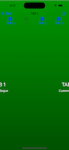
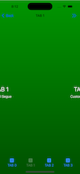

# SwipeTabController

## Overview

 

This package implements a "tabbed" view controller, that behaves in a manner similar to Android tabs.

Use this, in place of the classic Apple [`UITabBarController`](https://developer.apple.com/documentation/uikit/uitabbarcontroller/) (but not always. More on that, later).

[Here is the online documentation for this project](https://littlegreenviper.github.io/SwipeTabController/).

[Get the source code here (on GitHub)](https://github.com/LittleGreenViper/SwipeTabController).

## What Problem Does This Solve?

The standard iOS [`UITabBarController`](https://developer.apple.com/documentation/uikit/uitabbarcontroller/) has a number of restrictions, and the most obvious one, is that it does not behave like [`UIPageViewController`](https://developer.apple.com/documentation/uikit/uipageviewcontroller/), where you can "swipe" between the tabs.

Android does this. Android also usually has the tab bar on the top of the screen (like browser tabs), as opposed to the iOS positioning (at the bottom of the screen).

By implementing this module, you can have both the "swipe" behavior, and the ability to place the tab bar at either the top, or the bottom, of the screen.

It also helps to work around the issue of the [`UITabBarController`](https://developer.apple.com/documentation/uikit/uitabbarcontroller/)'s propensity to have a separate navigation stack. This module will integrate the displayed screen's navigation stack with the container's navigation stack, giving you continuity with the container's navigation.

And lastly, when implementing [`UITabBarController`](https://developer.apple.com/documentation/uikit/uitabbarcontroller/) in [iPadOS](https://apple.com/ipados), or [MacOS](https://apple.com/macos), Apple will swap out the fixed bottom tab bar, with a segmented control, at the top of the screen. This is not always what the user wants. ``LGV_SwipeTabViewController`` will enforce a consistent position for the "tab bar."

## Requirements

This is a [UIKit](https://developer.apple.com/documentation/uikit), [Swift](https://apple.com/swift)-only package. It is designed to be run on [iOS](https://apple.com/ios), [iPadOS](https://apple.com/ipados), or [Mac Catalyst](https://developer.apple.com/documentation/uikit/mac-catalyst), and is designed for native development, using [Apple Xcode](https://apple.com/xcode), or a compatible development system.

Implementing the package does not have any external dependencies (beyond the requirement for [iOS](https://apple.com/ios)/[UIKit](https://developer.apple.com/documentation/uikit)).

## ``LGV_SwipeTabViewController`` vs. [`UITabBarController`](https://developer.apple.com/documentation/uikit/uitabbarcontroller/)

Although ``LGV_SwipeTabViewController`` shares a lot of similarities with [`UITabBarController`](https://developer.apple.com/documentation/uikit/uitabbarcontroller/), there are some crucial differences.

### The Railway Analogy

- [`UITabBarController`](https://developer.apple.com/documentation/uikit/uitabbarcontroller/) is like a railway station. You get off one train, and get onto another one. The entire context changes. This means that each tab represents a "fresh start."

- ``LGV_SwipeTabViewController`` is more like a switch in the railway tracks. You stay on the train, but change the direction. The context is preserved. This is more akin to choosing a path at an intersection, and then, continuing on down that path.

This means that, if you want each tab to represent a big subset of fairly uinque functionality, then ``LGV_SwipeTabViewController`` might not be the right choice. If the idea is that each tab represents a specialization of a common UX, then it may be ideal.

The most noticeable thing about ``LGV_SwipeTabViewController``, is that show segues (where we slide in the next screen), hides the "tab bar." This is because you are still in the same context that you were in, when you brought in the ``LGV_SwipeTabViewController``, while the [`UITabBarController`](https://developer.apple.com/documentation/uikit/uitabbarcontroller/) maintains whole contexts. In that case, tab bar can remain, allowing you to select between contexts at any time.

### Swipe/Pan Gestures

The other big difference, is that ``LGV_SwipeTabViewController`` implements native swipe/pan gestures, and these will "argue" with swipe gestures in embedded views. If your views will have swipe gestures, then you probably shouldn't use ``LGV_SwipeTabViewController``.

## How to Get

The SwipeTabController is supplied as a GitHub repo, and can be fetched via [the Swift Package Manager](https://www.swift.org/documentation/package-manager/), or through [GitHub Carthage](https://github.com/Carthage/Carthage).

### Swift Package Manager

The most direct method, is to simply add the package in your Project Target, via the Package Dependencies tab.

The repo URI is [`git@github.com:LittleGreenViper/SwipeTabController.git`](git@github.com:LittleGreenViper/SwipeTabController.git). Specify this, and add the package to your project.

Once the package is installed, you will need to make sure that you import it, where you use it:

`import SwipeTabController`

### Carthage

Using Carthage, you'll need to add the following line to your [`Cartfile`](https://github.com/Carthage/Carthage/blob/master/Documentation/Artifacts.md):

`github "LittleGreenViper/SwipeTabController"`

Once you have the package installed, you may actually want to simply add [the main file](https://github.com/LittleGreenViper/SwipeTabController/blob/master/Sources/SwipeTabController/LGV_SwipeTabViewController.swift) to your project, directly, as opposed to building the package. The entire package is implemented in that single source file.

## Usage

In order to use this package, you must either instantiate, or subclass (and then instantiate that subclass of) the ``LGV_SwipeTabViewController`` class. This is the "wrapper" class that presents a screen with two main components:

- A "Tab Bar" (instance of [`UIToolbar`](https://developer.apple.com/documentation/uikit/uitoolbar))
  
- A Swipeable screen (instance of [`UIPageViewController`](https://developer.apple.com/documentation/uikit/uipageviewcontroller/)).

There are accessors to these elements, but you don't actually need to use them. The wrapper class abstracts them completely.

You can specify the vertical position of the tab bar and container. You can choose to have the tab bar on the top (Android-style), or the bottom (classic iOS-style). You can also choose to have the text for each tab item displayed under the image, or to its right.

### The ``LGV_SwipeTabViewControllerType`` Protocol

When you specify a "wrapped" view controller, it needs to conform to the ``LGV_SwipeTabViewControllerType`` protocol. The package provides a ``LGV_SwipeTab_Base_ViewController`` base class, that does this. You can choose to subclass (or instantiate) it for your own view controllers, but it is not necessary to use that class. It is, however, required that the embedded view controllers conform to ``LGV_SwipeTabViewControllerType``.

### [`UITabBarItem`](https://developer.apple.com/documentation/uikit/uitabbaritem)

Your view controller must also provide a [`tabBarItem`](https://developer.apple.com/documentation/uikit/uiviewcontroller/tabbaritem). This can have an image, and text, to be displayed in the tab bar.

The simplest way to implement the package, is to use the storyboard, but you can generate the classes programmatically, as long as the embedded view controller classes conform to the ``LGV_SwipeTabViewControllerType`` protocol.

> NOTE: The view controller **MUST** have a [`tabBarItem`](https://developer.apple.com/documentation/uikit/uiviewcontroller/tabbaritem). It **MUST** have either an image, a title, or both.

### Using the Storyboard

#### Using A Segue

If you will use the storyboard, then the easiest way to include view controllers, is by specifying a segue instance, between the main container view controller (an implementation of ``LGV_SwipeTabViewController``, or a subclass), and the embedded view controller class (a UIViewController subclass that conforms to ``LGV_SwipeTabViewControllerType``).

> NOTE: The Segue **MUST** have an ID, and that ID **MUST** Match the Embedded Controller Storyboard ID (so the embedded instance **MUST** have a storyboard ID). If the segue has an ID, but the view controller doesn't have a matching ID, you are likely to get a runtime crash.

The segue can be any type. It is only used as a placeholder, and is never executed. For convenience, the package supplies a simple custom segue class: ``SwipeTabSegue``.

#### Direct IDs

You can also specify the storyboard IDs of your view controllers, by adding them to the ``LGV_SwipeTabViewController.viewControllerIDs`` property. These need to be added **BEFORE** calling [super.viewDidLoad()](https://developer.apple.com/documentation/uikit/uiviewcontroller/viewdidload\(\)).

> NOTE: The storyboard-instantiated view controllers are **ALWAYS** sorted by their IDs. You need to programmatically instantiate, if you want to manage the order in another way.

### Direct Instantiation

You can also directly instantiate view controllers (either via storyboard, or directly). You add these by overriding the ``LGV_SwipeTabViewController.generatedViewControllers`` computed property, and supplying the instances in an array. This array is not sorted.

> NOTE: These are appended to any other view controllers that have been instantiated via segues or storyboard IDs.

## [The Test Harness App](https://github.com/LittleGreenViper/SwipeTabController/tree/master/Tests/SwipeTabControllerTestHarness)

The package provides a fairly robust and simple test harness app, that can be used to get an idea of what is required to implement the package.

In order to run this, you should select the "SwipeTabControllerTestHarness" scheme, and direct it to run on an iOS simulator or device. There is another variant of the same scheme that imports the SPM module. If you use that, ensure that the included module is up to date and installed.

## LICENSE

### [MIT license](https://opensource.org/licenses/MIT)
 
Permission is hereby granted, free of charge, to any person obtaining a copy
of this software and associated documentation files (the "Software"), to deal
in the Software without restriction, including without limitation the rights
to use, copy, modify, merge, publish, distribute, sublicense, and/or sell
copies of the Software, and to permit persons to whom the Software is
furnished to do so, subject to the following conditions:

The above copyright notice and this permission notice shall be included in all
copies or substantial portions of the Software.

THE SOFTWARE IS PROVIDED "AS IS", WITHOUT WARRANTY OF ANY KIND, EXPRESS OR
IMPLIED, INCLUDING BUT NOT LIMITED TO THE WARRANTIES OF MERCHANTABILITY,
FITNESS FOR A PARTICULAR PURPOSE AND NONINFRINGEMENT. IN NO EVENT SHALL THE
AUTHORS OR COPYRIGHT HOLDERS BE LIABLE FOR ANY CLAIM, DAMAGES OR OTHER
LIABILITY, WHETHER IN AN ACTION OF CONTRACT, TORT OR OTHERWISE, ARISING FROM,
OUT OF OR IN CONNECTION WITH THE SOFTWARE OR THE USE OR OTHER DEALINGS IN THE
SOFTWARE.

