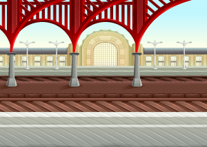

# SwipeTabController

## Overview

 

This package implements a "tabbed" view controller, that behaves in a manner similar to Android tabs.

Use this, in place of the classic Apple [`UITabBarController`](https://developer.apple.com/documentation/uikit/uitabbarcontroller/) (but not always. More on that, later).

## What Problem Does This Solve?

The standard iOS [`UITabBarController`](https://developer.apple.com/documentation/uikit/uitabbarcontroller/) has a number of restrictions, and the most obvious one, is that it does not behave like [`UIPageViewController`](https://developer.apple.com/documentation/uikit/uipageviewcontroller/), where you can "swipe" between the tabs.

Android does this. Android also usually has the tab bar on the top of the screen (like browser tabs), as opposed to the iOS positioning (at the bottom of the screen).

By implementing this module, you can have both the "swipe" behavior, and the ability to place the tab bar at either the top, or the bottom, of the screen.

It also helps to work around the issue of the [`UITabBarController`](https://developer.apple.com/documentation/uikit/uitabbarcontroller/)'s propensity to have a separate navigation stack. This module will integrate the displayed screen's navigation stack with the container's navigation stack, giving you continuity with the container's navigation.

And lastly, when implementing [`UITabBarController`](https://developer.apple.com/documentation/uikit/uitabbarcontroller/) in [iPadOS](https://apple.com/ipados), or [MacOS](https://apple.com/macos), Apple will swap out the fixed bottom tab bar, with a segmented control, at the top of the screen. This is not always what the user wants. ``LGV_SwipeTabViewController`` will enforce a consistent position for the "tab bar."

## ``LGV_SwipeTabViewController`` vs. [`UITabBarController`](https://developer.apple.com/documentation/uikit/uitabbarcontroller/)

Although the SwipeTabController shares a lot of similarities with [`UITabBarController`](https://developer.apple.com/documentation/uikit/uitabbarcontroller/), there are some crucial differences.

### The Railway Analogy

- [`UITabBarController`](https://developer.apple.com/documentation/uikit/uitabbarcontroller/) is like a railway station. You get off one train, and get onto another one. The entire context changes.

- ``LGV_SwipeTabViewController`` is more like a switch in the railway tracks. You stay on the train, but change the direction. The context is preserved.

This means that, if you want each tab to represent a big subset of fairly uinque functionality, then ``LGV_SwipeTabViewController`` might not be the right choice. If the idea is that each tab represents a specialization of a common UX, then it may be ideal.

### Swipe/Pan Gestures

The other big difference, is that ``LGV_SwipeTabViewController`` implements native swipe/pan gestures, and these will "argue" with swipe gestures in embedded views. If your views will have swipe gestures, then you probably shouldn't use ``LGV_SwipeTabViewController``.

## Usage

In order to use this package, you must either instantiate, or subclass (and then instantiate that subclass of) the ``LGV_SwipeTabViewController`` class. This is the "wrapper" class that presents a screen with two main components:

- A "Tab Bar" (instance of [`UIToolbar`](https://developer.apple.com/documentation/uikit/uitoolbar))
  
- A Swipeable screen (instance of [`UIPageViewController`](https://developer.apple.com/documentation/uikit/uipageviewcontroller/)).

There are accessors to these elements, but you don't actually need to use them. The wrapper class abstracts them completely.

You can specify the vertical position of the tab bar and container. You can choose to have the tab bar on the top (Android-style), or the bottom (classic iOS-style). You can also choose to have the text for each tab item displayed under the image, or to its right.

### The ``LGV_SwipeTabViewControllerType`` Protocol

When you specify a "wrapped" view controller, it needs to conform to the ``LGV_SwipeTabViewControllerType`` protocol. The package provides a ``LGV_SwipeTab_Base_ViewController`` base class, that does this. You can choose to subclass (or instantiate) it for your own view controllers, but it is not necessary to use that class. It is, however, required that the embedded view controllers conform to ``LGV_SwipeTabViewControllerType``.

### [`UITabBarItem`](https://developer.apple.com/documentation/uikit/uitabbaritem)

Your view controller must also provide a [`tabBarItem`](https://developer.apple.com/documentation/uikit/uiviewcontroller/tabbaritem). This can have an image, and text, to be displayed in the tab bar.

## LICENSE

### [MIT license](https://opensource.org/licenses/MIT)
 
Permission is hereby granted, free of charge, to any person obtaining a copy
of this software and associated documentation files (the "Software"), to deal
in the Software without restriction, including without limitation the rights
to use, copy, modify, merge, publish, distribute, sublicense, and/or sell
copies of the Software, and to permit persons to whom the Software is
furnished to do so, subject to the following conditions:

The above copyright notice and this permission notice shall be included in all
copies or substantial portions of the Software.

THE SOFTWARE IS PROVIDED "AS IS", WITHOUT WARRANTY OF ANY KIND, EXPRESS OR
IMPLIED, INCLUDING BUT NOT LIMITED TO THE WARRANTIES OF MERCHANTABILITY,
FITNESS FOR A PARTICULAR PURPOSE AND NONINFRINGEMENT. IN NO EVENT SHALL THE
AUTHORS OR COPYRIGHT HOLDERS BE LIABLE FOR ANY CLAIM, DAMAGES OR OTHER
LIABILITY, WHETHER IN AN ACTION OF CONTRACT, TORT OR OTHERWISE, ARISING FROM,
OUT OF OR IN CONNECTION WITH THE SOFTWARE OR THE USE OR OTHER DEALINGS IN THE
SOFTWARE.

